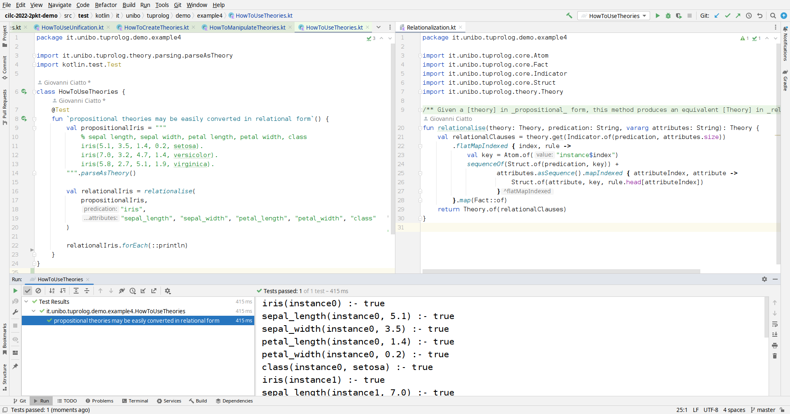

## Context

- Logic-based technologies (LBT) are either built
    * on top of Prolog
    * from Scratch

- Building LBT on top of Prolog means
    * be tailored on the way Prolog does stuff
    * either rely on FLI, or call Prolog from the command line, or write in Prolog

- Building LBT from scratch means
    * reinventing the wheel over and over again

## Why 2P-Kt

- Provide LP functialities
    * __as a library__, for mainstream programming languages
    * __individually__, to ease selective exploitation and combination
    * to as many platform/languages as possible, hence __maximising the potential audience__ 

- Provide an ecosystem of logic-based facilities aimed for re-use, e.g.
    * to create novel logic-based facilities
    * to exploit LP in every-day programming

- Avoid the need for reimplementing the same functionalities on a per-project basis
    * e.g. terms/clauses contruction/manipulation, unification, etc.
    * providing the facilities as ready-to-use, and customisable libraries

## Demonstration of 2P-Kt functionalities

We shall demonstrate "How to do stuff" in 2P-Kt, in particular concerning:
 
1. terms and clauses manipulation
    - creation, exploitation, parsing, and formatting

2. unification of terms and clauses

3. theories manipulation
    - creation, exploitation, parsing

4. resolution
    - e.g. in Prolog, or concurrent LP

### Terms 

#### Creation

#### Manipulation

#### Non-trivial usage example

### Clauses

#### Creation

#### Manipulation

### Unification

### Theories

#### Creation

#### Manipulation

#### Non-trivial usage example

### Solvers

#### Creation and usage

#### Extend solvers with primitives

